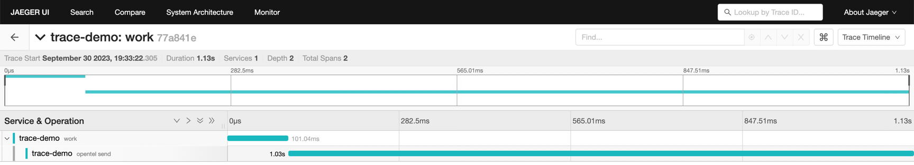
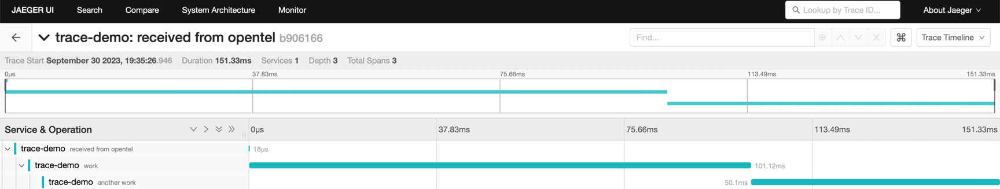
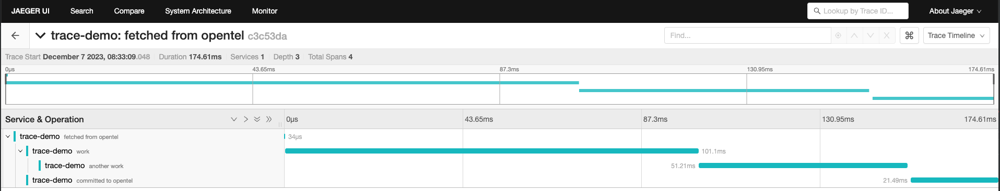

# Otel Kafka Konsumer

This library enables distributed tracing on the [segmentio/kafka-go](https://github.com/segmentio/kafka-go) library and is used on [kafka-konsumer](https://github.com/Trendyol/kafka-konsumer). 
You can use it without integration kafka-konsumer.

Please refer to [example](example) to learn how to use it. You can also look at [the open-telemetry go documentation](https://opentelemetry.io/docs/instrumentation/go/getting-started/)

# Demo

In the examples, you can run 
```sh
docker-compose up --build
```

## Producing



## Consuming



## Consuming With Manual Commit



## Bring it all together

You can run producer and consumer, respectively, to see that they work together.


