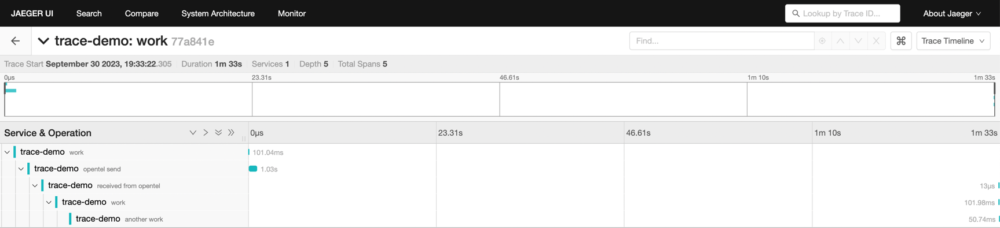

# Otel Kafka Konsumer

This library enables distributed tracing on the segmentio/kafka-go library and is used on kafka-konsumer.

Please refer to examples to learn how to use it.

You can follow the release status by subscribing [this issue](https://github.com/Trendyol/kafka-konsumer/issues/18)

It will be released soon.

# Demo

In the examples, you can run 
```sh
docker-compose up --build
```

## Producing


## Consuming


## Bring it all together

You can run producer and consumer, respectively, to see that they work together.

